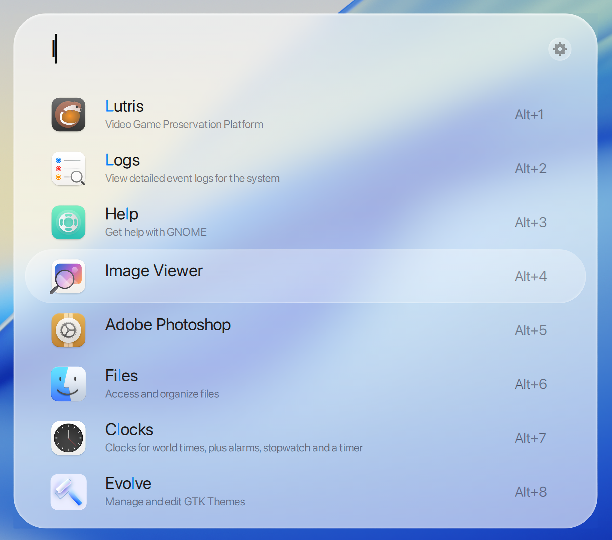
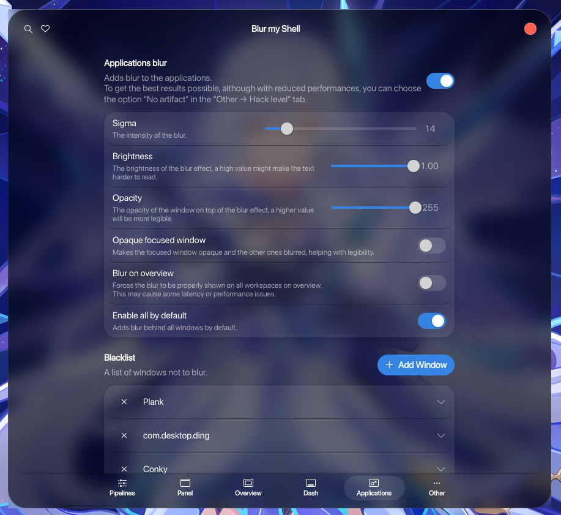

# Liquid Glass Ulauncher

A theme for Ulauncher based on macOS Tahoe Liquid Glass theme.

## Screenshot

<p align="center">
  
  
</p>

## Installation:

1. Clone Repo

```sh
git clone https://github.com/kayozxo/ulauncher-liquid-glass.git
```

2. Change Directory

```sh
cd ulauncher-liquid-glass
```

3. Run Script

```sh
./install.sh
```

## How to achieve blur - **GNOME ONLY**

- To achieve true liquid glass finish, you need some amount of blur for the launcher.
- But GTK doesn't support any blur filter through CSS.
- Install [Blur My Shell](https://extensions.gnome.org/extension/3193/blur-my-shell/)
- Apply the settings as follows:


